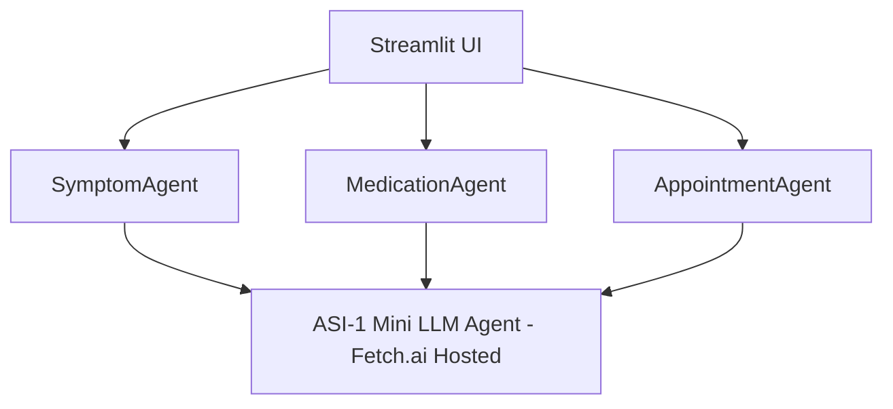

# 🩺 HealthConnect AI - Multi-Agent Healthcare Assistant

HealthConnect is a multi-agent AI healthcare assistant powered by [Fetch.ai's](https://fetch.ai) **Agentverse** and the **ASI-1 Mini LLM agent**. It routes queries through intelligent micro-agents for personalized responses.

---

## 🚀 Features

- 🤒 Symptom Checker Agent (port 8003)
- 💊 Medication Reminder Agent (port 8004)
- 📅 Appointment Scheduler Agent (port 8010)
- 🧠 All agents use the ASI-1 Mini LLM for intelligent replies
- 💬 Frontend powered by Streamlit

---

## 🧱 Architecture



---

## 📁 Project Structure

```
HealthConnectAI/
│
├── symptom_agent.py
├── medication_agent.py
├── appointment_agent.py
├── app.py (Streamlit frontend)
├── requirements.txt
├── /agent_logs
└── README.md (this file)
```

---

## ⚙️ Setup

### 1. Clone & Install Dependencies

```bash
git clone https://github.com/yourusername/healthconnect-ai.git
cd healthconnect-ai
python -m venv .venv
source .venv/bin/activate
pip install -r requirements.txt
```

### 2. Run Agents (Each in a New Terminal)

```bash
# Symptom Agent (port 8003)
SSL_CERT_FILE=$(python -m certifi) python symptom_agent.py

# Medication Agent (port 8004)
SSL_CERT_FILE=$(python -m certifi) python medication_agent.py

# Appointment Agent (port 8010)
SSL_CERT_FILE=$(python -m certifi) python appointment_agent.py
```

### 3. Run Streamlit App

```bash
streamlit run app.py
```

---

## 🌐 Agentverse Deployment

Each agent can also be deployed directly via [Agentverse](https://agentverse.ai) with `mailbox=True` and proper `/submit` endpoints. Use the generated agent address to connect with your frontend.

---

## 📄 License

This project is part of the Fetch.ai Innovation Lab. For non-commercial use only.

---

## 🤝 Contributing

PRs and feature ideas are welcome. Feel free to fork and enhance!
